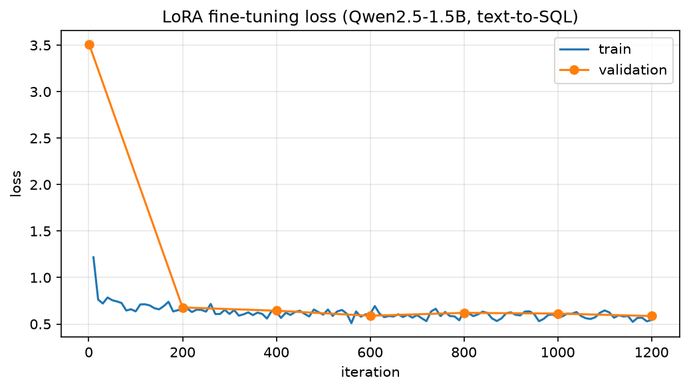

# Text-to-SQL: LoRA Fine-Tuning of Qwen2.5-1.5B on Apple Silicon

Fine-tunes [Qwen2.5-1.5B-Instruct (4-bit)](https://huggingface.co/mlx-community/Qwen2.5-1.5B-Instruct-4bit)
to translate natural-language questions into SQL queries, trained **locally on a MacBook Pro
(Apple M5, 16 GB)** with Apple's [MLX](https://github.com/ml-explore/mlx-lm) framework.

The setup is QLoRA-style: the base model stays frozen in 4-bit quantization and only
rank-16 LoRA adapters train — which is why a 1.5B-parameter fine-tune fits in laptop memory.

Full write-up (problem statement, design decisions, challenges): **[REPORT.md](REPORT.md)**

## Results

Evaluated on 200 held-out examples (never seen in training), greedy decoding,
base model vs fine-tuned compared under identical conditions:

| metric | base model | fine-tuned |
|---|---|---|
| Exact match | 53.5% | **75.5%** |
| Execution validity | 95.0% | **97.0%** |

52 of 200 test questions that the base model answered incorrectly are exactly correct
after fine-tuning. Training took ~15 minutes on an M5 (peak memory 2.7 GB).

- **Exact match** — normalized string equality with the gold SQL (strict lower bound).
- **Execution validity** — the query executes without error against the schema built in an
  in-memory SQLite database (catches hallucinated tables/columns and syntax errors).



## Quickstart

Requires an Apple Silicon Mac (MLX does not run on Intel/CUDA machines).

```bash
python3 -m venv .venv && source .venv/bin/activate
pip install -r requirements.txt

python scripts/prepare_data.py            # download dataset, write train/valid/test splits
bash scripts/train.sh                     # LoRA fine-tune (~1-2 h on M-series, 16 GB)
python scripts/plot_loss.py               # reports/loss_curve.png from the training log
python scripts/generate_predictions.py    # base + fine-tuned SQL for the 200 test questions
python scripts/evaluate.py --examples 5   # metrics table + before/after examples
```

## Repository layout

```
configs/lora_qwen2.5-1.5b.yaml   training hyperparameters (model, LoRA rank, LR, iters)
scripts/prompt_format.py         shared prompt template (train and inference must match)
scripts/prepare_data.py          b-mc2/sql-create-context -> MLX chat-format jsonl splits
scripts/train.sh                 mlx_lm.lora wrapper, logs to reports/train.log
scripts/plot_loss.py             loss curve from the training log
scripts/generate_predictions.py  greedy decoding on the test set, with/without adapter
scripts/evaluate.py              exact match + SQLite execution validity (stdlib only)
predictions.json                 all 200 test predictions, base vs fine-tuned (after run)
reports/                         training log + loss curve (after run)
```

## Dataset

[b-mc2/sql-create-context](https://huggingface.co/datasets/b-mc2/sql-create-context)
(~78k examples, CC-BY-4.0): each example is a `CREATE TABLE` schema, a natural-language
question, and the gold SQL answer. Splits used here — 8,000 train / 200 validation /
200 test, disjoint, fixed by seed 42.
